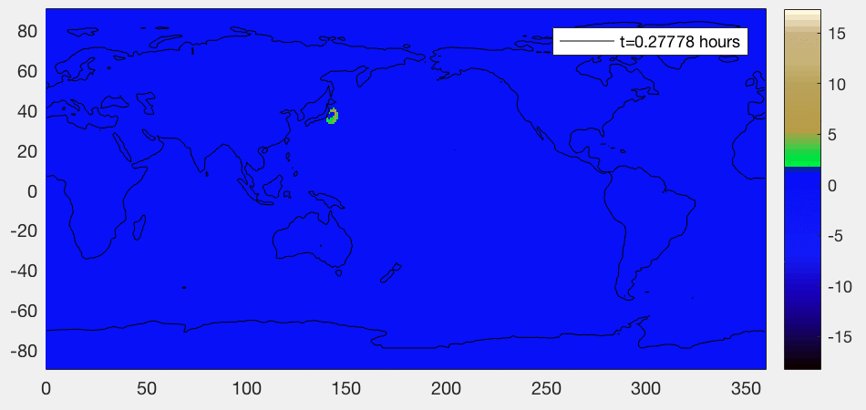

# Tsumami Simulation

This program simulates the behavior of water waves in a square pond by stepping the wave equation forward in time. The waves start at the initial condition and travel outward. When the waves hit the boundary, they reflect back and the orientation of their reflection is determined by the type of boundary condition.

There are two types of boundary conditions:
- Dirichlet boundary condition: The wave reflected off the boundary is an inversion the incoming wave.
- Neumann boundary condition: The wave reflected off the boundary is in the same orientation as the incoming wave. (water waves follow this condition)

This program simulates the Japanese 2011 Tohoku tsunami. The Tohoku tsunami originated from an undersea earthquake with a magnitude of 9.0 on March 11, 2011. I used MATLAB’s built in topo (topographic) map’s water depth data to calculate velocities at every grid point with an elevation equal to or below 0 (sea level) while stepping the wave equation forward in time, keeping Neumann conditions in mind for elevations greater than 0. Since the topographic data is based on latitudes and longitudes, I made the x step and y steps of the grid, 102470m and 111320m respectively to correspond to the approximate number of meters per degree of latitude and longitude.

Earthquakes are caused by the subduction of tectonic plates. When plates under water, they displace water proportional to the amount that the plate slipped. A seismic moment M, can be calculated using

M=GAΔw=10(1.5m+9.1) (Equation 1)

where G is the shear modulus of rock, A is the area, Δw is the change in the position or the amount of slip of the plate, and m is approximately equal to the empirical Richter scale number of the earthquake. Since Japan’s earthquake has been classified with a magnitude of 9.0, m=9,

M = 10(1.5*9+9.1) ≈ 4x1022 Nm.

The G in this case is equal to approximately 3x1010Pa, which simplifies Equation 1 to
AΔw≈1012m3

Therefore, the amount of water displaced is on the order of 1012m3. I used 5 grid points for the initial condition over the approximate location of the fault based on the image found at http://www.nasa.gov/topics/earth/features/earthquake20110519.html. The total area encapsulated by these 5 grid points is approximately 57,034,802,000 square meters. I distributed the initial heights of each of these grid points such that the total volume of water would be approximately 1012m3 as previously calculated. Using this simulation, it takes approximately 15 hours for the waves to reach the coast of California.
